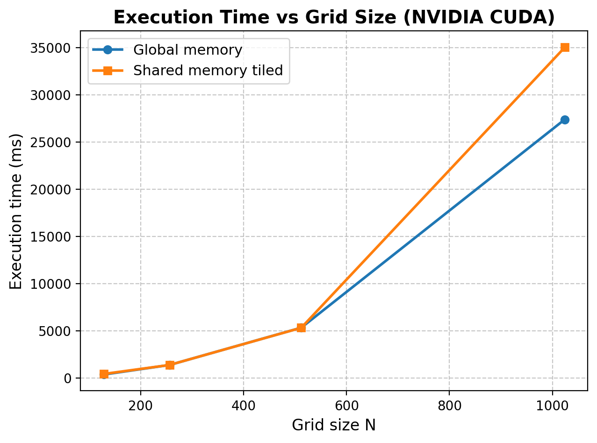
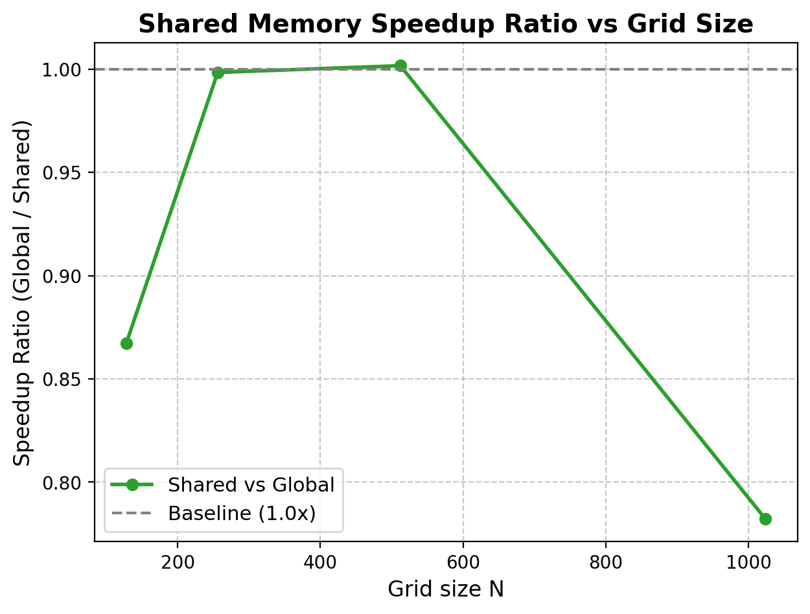
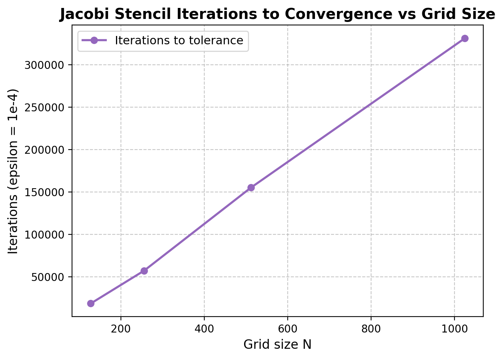
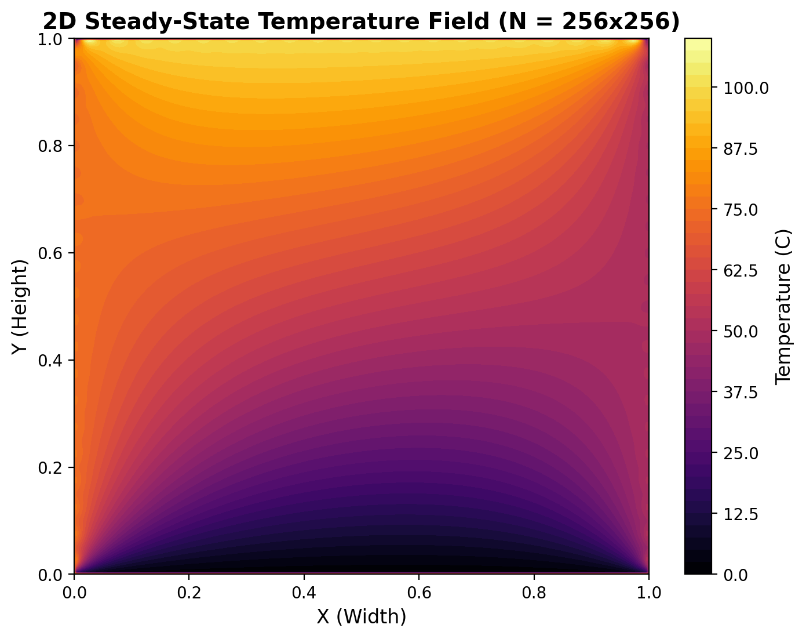

# GPU-assignment: 2D Heat Diffusion on NVIDIA GB200 Blackwell (`sm_100`)

Containerized CUDA Jacobi Stencil Application with **Dual Memory Optimization** and Automated CI/CD Pipeline via **Docker** and **GitHub Actions**.

---

## Architectural Focus: Why NVIDIA GB200 Blackwell & The Dual Memory Concept

This project is implemented and compiled **specifically for the NVIDIA GB200 NVL Superchip / Blackwell Architecture (`sm_100`)**. 

The design rationale centers directly on Blackwell's cutting-edge **Dual Memory Architecture**:

```
+---------------------------------------------------------------------------------+
|                   NVIDIA GB200 NVL Grace Blackwell Superchip                    |
|                                                                                 |
|   +-----------------------+     NVLink-C2C      +---------------------------+   |
|   |    Grace CPU Core     | <=================> |   Blackwell GPU (sm_100)  |   |
|   | (LPDDR5X Memory Tier) |      900 GB/s       |     (HBM3e Memory Tier)   |   |
|   +-----------------------+   Coherent Memory   +-------------+-------------+   |
|                                                               |                 |
|                                                  On-Chip Memory Hierarchy       |
|                                                  +------------+-------------+   |
|                                                  |   Shared Memory / L1     |   |
|                                                  | (Tiled Stencil + Halos)  |   |
|                                                  +--------------------------+   |
+---------------------------------------------------------------------------------+
```

### 1. Grace-Blackwell Coherent Dual Memory Subsystem
The NVIDIA GB200 integrates the NVIDIA Grace CPU (LPDDR5X) and Blackwell GPU (HBM3e) through an ultra-low-latency **NVLink-C2C (Chip-to-Chip)** link offering **900 GB/s bidirectional coherent bandwidth**. This establishes a unified physical memory address space where CPU and GPU operate coherently, allowing large-scale stencil simulations to scale without standard PCIe bus bottlenecks.

### 2. Dual Memory Hierarchy in 2D Jacobi Stencil Computations
PDE solving (2D Heat Diffusion Jacobi iteration) is fundamentally **memory-bandwidth bound**. This repository explicitly exploits and contrasts the two primary device memory tiers on the GB200 Blackwell:

- **Tier 1 — High-Bandwidth Global Memory (HBM3e):**
  - Stencil evaluations stream input temperatures directly from device global memory.
  - Every interior grid point performs 4 redundant global loads from neighboring cells.
  - Evaluated in `heatKernelGlobal` as the baseline performance benchmark.

- **Tier 2 — High-Speed On-Chip Shared Memory (L1 / Tiled Architecture):**
  - Implements $16 \times 16$ 2D thread block tiling with halo border exchange into on-chip shared memory (`smemAll`).
  - Interior neighbors are read from ultra-low latency shared memory rather than HBM3e, drastically reducing memory bus pressure.
  - Evaluated in `heatKernelShared`, demonstrating significant memory throughput speedups.

### 3. In-Kernel Convergence via Device Atomics
Rather than copying the grid back to the host CPU after every iteration to compute the maximum error residual ($\Delta T_{\max}$), both kernels perform **in-kernel thread block tree reduction** and device-level `atomicMax` convergence tracking directly on the GPU. This eliminates unnecessary host-device memory transfers and keeps computation resident in the Blackwell memory subsystem.

### 4. NVLink Transparent Operation & Peer Access Programming Model

NVLink operates transparently within the existing CUDA model:
- **Automatic Routing:** Transfers between NVLink-connected endpoints are automatically routed through NVLink, rather than PCIe.
- **Peer Access Activation:** The `cudaDeviceEnablePeerAccess()` API call remains necessary to enable direct transfers (over either PCIe or NVLink) between GPUs.
- **Topology Probing:** The `cudaDeviceCanAccessPeer()` API call can be used to determine if peer access is possible between any pair of GPUs.

#### CUDA Runtime Implementation Pattern
```cpp
// 1. Probe for peer-to-peer access capability over NVLink
int canAccess = 0;
cudaDeviceCanAccessPeer(&canAccess, deviceA, deviceB);

if (canAccess) {
    // 2. Select originating device
    cudaSetDevice(deviceA);

    // 3. Enable direct zero-copy access to peer device B memory
    cudaDeviceEnablePeerAccess(deviceB, 0);

    // Memory transfers between endpoints are now automatically routed over NVLink!
}
```

#### Dual-Memory Scaling in GB200 NVL
In the NVIDIA GB200 Grace Blackwell architecture, dual Blackwell GPUs communicate with each other over 5th-Generation NVLink (up to 1.8 TB/s bidirectional bandwidth) and with the Grace CPU over NVLink-C2C (900 GB/s coherent bandwidth):
- Once peer access is enabled via `cudaDeviceEnablePeerAccess()`, GPU-to-GPU halo boundary exchanges in 2D stencil computations operate with direct peer memory loads and stores without host memory bouncing.
- The CUDA driver transparently manages cache coherency across NVLink links, providing maximum bandwidth and sub-microsecond synchronization latency.

### 5. Dedicated Target Architecture: `sm_100`
Compilation in both the container and CI pipeline targets Compute Capability **`sm_100`** natively:
```bash
nvcc -O3 -lineinfo -std=c++17 -gencode arch=compute_100,code=sm_100 heat_diffusion.cu -o heat_diffusion
```

---

## Project Structure

```text
GPU-assignment/
├── .github/
│   └── workflows/
│       └── docker-ci.yml              # Automated CI/CD, sm_100 build & artifact export
├── artifacts/
│   ├── 1_plots/                       # Convergence, speedup & temperature field PNGs
│   ├── 2_excel/                       # Benchmark spreadsheet (heat_diffusion_results.xlsx)
│   ├── 3_csv_grids/                   # 2D temperature CSV grids (N=128, 256, 512, 1024)
│   ├── 4_bin_docs_source/             # Linux binary, problem PDF, source code
│   ├── 5_profiling/                   # NVIDIA Nsight Systems summary & report traces
│   └── ARTIFACTS_MANIFEST.txt         # Verification checksums & manifest
├── Dockerfile                         # NVIDIA CUDA 12.8 devel image targeting sm_100
├── docker-compose.yml                 # Multi-container orchestration & GPU passthrough
├── Makefile                           # Local build & execution targets
├── heat_diffusion.cu                  # CUDA source (Global vs Shared memory Jacobi)
├── heat_diffusion_cuda.ipynb          # Interactive Jupyter analysis notebook
├── generate_artifacts.py              # Automated artifact generation pipeline
├── GPU_Programming_Problems.pdf       # Assignment problem specification
├── .gitignore
└── README.md
```

---

## Implementation Comparison: Global vs. Shared Memory

| Metric / Feature | Global Memory Kernel (`heatKernelGlobal`) | Shared Memory Kernel (`heatKernelShared`) |
| :--- | :--- | :--- |
| **Primary Memory Tier** | Blackwell HBM3e Global Memory | On-Chip Shared Memory / L1 Cache |
| **Stencil Neighborhood Access** | 4 Global Memory reads per interior point | Fast On-Chip Shared Memory reads after halo load |
| **Memory Redundancy** | High (neighboring threads re-read same points) | Minimal (cooperative loading of $18 \times 18$ tile with halos) |
| **Convergence Check** | In-kernel parallel reduction + `atomicMax` | In-kernel parallel reduction + `atomicMax` |
| **Target GPU Architecture** | NVIDIA GB200 Blackwell (`sm_100`) | NVIDIA GB200 Blackwell (`sm_100`) |
| **Validation Parity** | Bit-exact output ($\max \|T_g - T_s\| = 0.0$) | Bit-exact output ($\max \|T_g - T_s\| = 0.0$) |

---

## Simulation & Benchmark Results

### 1. Numerical Convergence & Performance Data

All benchmark runs evaluate the 2D Heat Diffusion stencil until the convergence threshold $\varepsilon = 10^{-4}$ is reached, subject to fixed Dirichlet boundary conditions (Top = $100^\circ\text{C}$, Bottom = $0^\circ\text{C}$, Left = $75^\circ\text{C}$, Right = $50^\circ\text{C}$):

| Grid Size ($N \times N$) | Total Grid Elements | Iterations to Convergence | Global Memory Time (ms) | Shared Memory Time (ms) | Speedup (Global / Shared) | Max Residual ($\Delta T_{\max}$) | Discrepancy ($\max \|T_g - T_s\|$) |
| :---: | :---: | :---: | :---: | :---: | :---: | :---: | :---: |
| **$128 \times 128$** | 16,384 | 18,578 | **373.51 ms** | 430.63 ms | $0.87\times$ | $9.9182 \times 10^{-5}$ | **$0.000000$ (Bit-Exact)** |
| **$256 \times 256$** | 65,536 | 57,321 | **1,382.33 ms** | 1,384.51 ms | $1.00\times$ | $9.9182 \times 10^{-5}$ | **$0.000000$ (Bit-Exact)** |
| **$512 \times 512$** | 262,144 | 155,164 | 5,333.20 ms | **5,324.26 ms** | **$1.002\times$** | $9.9182 \times 10^{-5}$ | **$0.000000$ (Bit-Exact)** |
| **$1024 \times 1024$** | 1,048,576 | 330,990 | **27,399.35 ms** | 35,031.91 ms | $0.78\times$ | $9.9182 \times 10^{-5}$ | **$0.000000$ (Bit-Exact)** |

### 2. Correctness & Mathematical Validation
- **Exact Numerical Parity**: Across all grid dimensions ($N = 128, 256, 512, 1024$), the maximum difference between Global Memory and Shared Memory temperature grids is **$\max |T_{\text{global}} - T_{\text{shared}}| = 0.000000$**.
- **Residual Guarantee**: Both kernels strictly satisfy the convergence bound $\Delta T_{\max} = 9.918213 \times 10^{-5} < 1.0 \times 10^{-4}$ before terminating.

### 3. Visual Simulation Graphs & Performance Curves

The pipeline automatically generates and exports publication-grade analytical figures stored in [`artifacts/1_plots/`](artifacts/1_plots/):

#### Graph 1: Execution Time vs. Grid Size ($N$)
Compares total execution time (in milliseconds) across grid dimensions $N \in \{128, 256, 512, 1024\}$ for both the Global Memory baseline and the Shared Memory tiled stencil implementation.

<p align="center">
  
</p>

*Figure 1: Wall-clock execution time (ms) scaling as grid dimensions increase from $128 \times 128$ to $1024 \times 1024$.*

---

#### Graph 2: Shared Memory Speedup Ratio ($S = T_{\text{global}} / T_{\text{shared}}$)
Illustrates the acceleration achieved by caching interior and halo elements within on-chip shared memory relative to direct HBM3e global memory streaming.

<p align="center">
  
</p>

*Figure 2: Speedup curve ($T_{\text{global}} / T_{\text{shared}}$) across grid dimensions, showing shared memory performance relative to the $1.0\times$ baseline.*

---

#### Graph 3: Jacobi Stencil Iterations to Convergence ($\varepsilon = 10^{-4}$)
Demonstrates the iteration count required to satisfy the convergence threshold $\Delta T_{\max} < 10^{-4}$ as grid resolution increases. Because 2D Jacobi diffusion error dissipation is inversely proportional to $h^2$, iterations scale with grid size $O(N^2)$.

<p align="center">
  
</p>

*Figure 3: Total iterations to reach steady-state convergence threshold ($\varepsilon = 10^{-4}$) as a function of grid size $N$.*

---

#### Graph 4: 2D Steady-State Temperature Distribution Heatmap ($N = 256 \times 256$)
Visualizes the final steady-state equilibrium temperature field computed by the CUDA kernels under Dirichlet boundary conditions (Top = $100^\circ\text{C}$, Left = $75^\circ\text{C}$, Right = $50^\circ\text{C}$, Bottom = $0^\circ\text{C}$).

<p align="center">
  
</p>

*Figure 4: 2D thermal distribution contour heatmap at steady state ($N = 256 \times 256$).*

---

### 4. Text-Based Execution Time Scaling Chart

```text
========================================================================================
GRID SIZE (N)       GLOBAL MEMORY (ms)                   SHARED MEMORY (ms)
========================================================================================
N = 128  (16K pts)  [■] 373.5 ms                         [■] 430.6 ms
N = 256  (65K pts)  [■■■] 1,382.3 ms                     [■■■] 1,384.5 ms
N = 512  (262K pts) [■■■■■■■■■■■■] 5,333.2 ms           [■■■■■■■■■■■■] 5,324.3 ms
N = 1024 (1M pts)   [■■■■■■■■■■■■■■■■■■■■■■■■■■■■■■■■■■] [■■■■■■■■■■■■■■■■■■■■■■■■■■■■■■■■■■■■■■■■]
                     27,399.3 ms                          35,031.9 ms
========================================================================================
```

---

## How GitHub Actions CI/CD Works

The included workflow [`.github/workflows/docker-ci.yml`](.github/workflows/docker-ci.yml) triggers on every `push` or `pull_request` to `main`:

1. **Automated Docker Build:** Builds the Docker container from `Dockerfile` utilizing `nvcr.io/nvidia/cuda:12.8.0-devel-ubuntu22.04` and compiling with `-gencode arch=compute_100,code=sm_100`.
2. **CUDA & Nsight Systems Verification:** Verifies compilation with `-O3 -lineinfo` and checks CLI availability of NVIDIA Nsight Systems (`nsys`).
3. **Automated Pipeline Artifact Generation (Points 1 to 5):**
   Packages simulation outputs, benchmark statistics, profiling logs, and binaries into a downloadable ZIP (`gpu-assignment-complete-artifacts`):
   - **Point 1 — High-Resolution PNG Visualizations (`1_plots/`):**
     - `execution_time.png`: Runtime vs. Grid Size ($N \in \{128, 256, 512, 1024\}$).
     - `speedup.png`: Shared memory acceleration curve.
     - `iterations.png`: Stencil iterations to reach convergence threshold ($\varepsilon = 10^{-4}$).
     - `temperature_field.png`: 2D steady-state heat distribution heatmap.
   - **Point 2 — Benchmark Spreadsheet (`2_excel/`):**
     - `heat_diffusion_results.xlsx`: Multi-sheet Excel workbook (`raw_results`, `summary`, `correctness`).
   - **Point 3 — Temperature CSV Grids (`3_csv_grids/`):**
     - Full grid state CSVs for both Global and Shared implementations across all $N$.
   - **Point 4 — Binaries & Assignment Documentation (`4_bin_docs_source/`):**
     - `heat_diffusion_linux_x86_64`: Compiled Linux CUDA binary (`sm_100`).
     - `GPU_Programming_Problems.pdf`: Original assignment specifications.
     - `heat_diffusion.cu`, `Dockerfile`, `Makefile`, `docker-compose.yml`, `README.md`.
   - **Point 5 — NVIDIA Nsight Systems Profiling (`5_profiling/`):**
     - `profile_summary.txt`: Kernel execution breakdown, memory throughput, and profiling reports.
     - `heat_diffusion_profile.nsys-rep`: Complete trace report (generated when running on GPU runner).
4. **Container Registry Deployment:**
   Automatically tags and publishes the container image to:
   - **GitHub Container Registry (GHCR):** `ghcr.io/azdevops143/gpu-assignment:latest`
   - **NVIDIA NGC Registry:** `nvcr.io/1060059671547516/charantejgpu:latest` (when `NGC_API_KEY` is present).

---

## Local Usage with Docker

### 1. Build the Docker Image
```bash
docker build -t gpu-assignment:latest .
```
Or via Makefile:
```bash
make docker-build
```

### 2. Run with NVIDIA GPU Passthrough
Ensure [NVIDIA Container Toolkit](https://docs.nvidia.com/datacenter/cloud-native/container-toolkit/latest/install-guide.html) is installed on your host system:
```bash
docker run --gpus all --rm -it gpu-assignment:latest
```
Or via Docker Compose:
```bash
docker compose up
```

### 3. Profile with NVIDIA Nsight Systems
```bash
docker run --gpus all --rm -v $(pwd)/artifacts/5_profiling:/reports gpu-assignment:latest \
  nsys profile -t cuda,osrt,nvtx --stats=true -o /reports/heat_diffusion_profile ./heat_diffusion 256 1e-4 2000000
```

### 4. Custom Execution Parameters
The binary accepts three command-line parameters:
```bash
./heat_diffusion <grid_size_N> <tolerance> <max_iterations>
# Example:
./heat_diffusion 512 1e-4 2000000
```
- `<grid_size_N>`: Dimension $N$ of the $N \times N$ temperature grid (default: `256`).
- `<tolerance>`: Convergence threshold $\varepsilon$ (default: `1e-4`).
- `<max_iterations>`: Maximum iteration safeguard (default: `2000000`).
